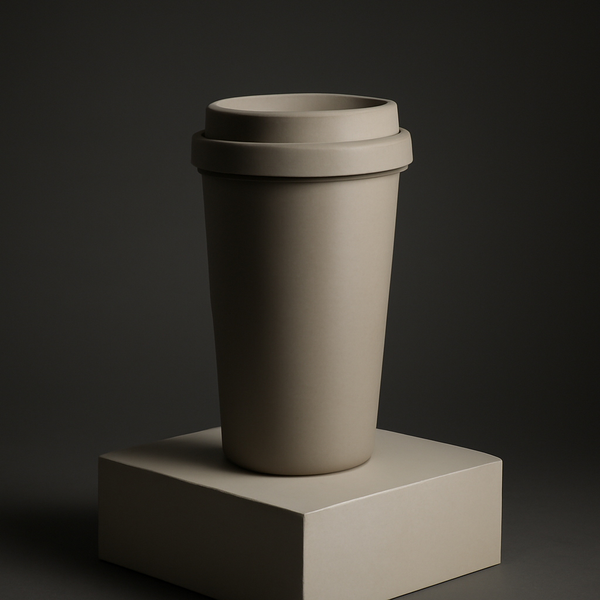

# B2-3 「AI 기반 소셜 미디어 콘텐츠 자동 생성」 — 모범답안

> 미션 원문은 [`문제.md`](문제.md) 참고. 주제: **"친환경 텀블러 신제품 출시"**.
> 사용 도구: Make(자동화), Notion(저장), Claude/OpenAI API(플랫폼별 텍스트), 네이토(이미지).

> ⚠️ **진행 상태**: 이미지 관련 산출물(대표 이미지, 보너스 A/B)은 **전부 실제 생성
> 완료**. 플랫폼별 텍스트는 네이토 챗 서버 일시 오류로 프롬프트 설계까지만 완료 —
> §4 참고. Make/Notion 실제 구축은 진행 중.

## 0. 요구사항 충족 매핑 (셀프 체크)

| 요구사항 | 충족 위치 | 상태 |
|---|---|---|
| 워크플로우 구조 스크린샷 | `captures/make/` | ⬜ |
| 단계별 역할·연결 구조 문서 | §2 | ✅ |
| 3개 플랫폼 텍스트 | §4 (설계 완료) | ⏳ 실응답 대기 |
| 대표 이미지 1장 이상 | `images/final/01-대표이미지-친환경텀블러.png` | ✅ |
| 노션 저장(플랫폼별 구분) | §3 | 🔧 |
| 프로젝트 개요·팀역할·작업요약 | §5 | ✅ |
| 프롬프트 템플릿 문서(설계+수정과정) | §4 | ✅ 이미지 / ⏳ 텍스트 |
| 입력 트리거 | §2 STEP 1 | 🔧 |
| 플랫폼 특성 반영(포맷·톤) | §4 각 프롬프트 조건절 | ✅ |
| 이미지 SNS 활용 가능 품질 | `images/final/` | ✅ |
| 보너스1 — 톤 다른 2버전 | 이미지: `images/bonus-ab/` ✅ / 텍스트: ⏳ |

## 1. 대표 이미지


네이토(`gpt-image-1-mini`, `1024x1024`, low, 1,667 vt)로 생성.

## 2. 워크플로우 구조

```
[1] 주제 입력 (Make Webhook 또는 Google Forms)
        ↓
[2] Router 3-way 분기 — 인스타그램 / 블로그 / X
        ↓
[3] 각 경로: Claude/OpenAI API HTTP 호출 (플랫폼별 프롬프트, §4)
        ↓
[4] 대표 이미지 생성 (OpenAI 이미지 API 또는 네이토 생성물 재사용)
        ↓
[5] 노션 저장 — 플랫폼별 행 3개 생성 (주제/플랫폼/콘텐츠/이미지)
```

## 3. 노션 데이터베이스 속성

| 속성명 | 타입 |
|---|---|
| 주제 | Title |
| 플랫폼 | Select (인스타그램/블로그/X) |
| 콘텐츠 | Text |
| 이미지 | Files & media |

## 4. 프롬프트 템플릿

### 인스타그램 (짧은 캡션 + 해시태그 10개 내외)
```
다음 주제로 인스타그램 게시글 캡션을 써줘.
주제: {topic}
조건: 첫 줄은 강한 훅 문장, 전체 3~4문장, 이모지 2~3개, 마지막 줄에 해시태그
10개 내외(한글+영문), 친근한 구어체.
```

### 블로그 (500자 이상 + 소제목 구조)
```
다음 주제로 블로그 게시글 본문을 써줘.
주제: {topic}
조건: 500자 이상, 소제목(##) 2~3개, 정보 전달 위주(과장 지양).
```

### X/트위터 (280자 이내)
```
다음 주제로 X(트위터) 게시글을 써줘.
주제: {topic}
조건: 280자 이내(공백 포함), 핵심 정보 1~2가지만, 해시태그 1~2개.
```

**설계 근거**: 각 조건은 미션이 명시한 플랫폼별 포맷 예시를 그대로 반영. 글자수
제한(X)은 프롬프트에 숫자로 직접 못박았고, 해시태그 개수는 플랫폼 관례(인스타는
많이, X는 적게)를 따랐다.

**상태**: 네이토 챗 서버 오류로 실제 생성 결과 미확인 — 서비스 복구 후 실행,
초안→수정→최종 과정을 이 절에 채워넣을 예정.

### 이미지 프롬프트 — ✅ 실제 생성 완료
```
Product photo mockup for social media, an eco-friendly reusable tumbler on a wooden
table with soft natural light, minimal green plant in background, clean modern
aesthetic, no text anywhere in the image
```

## 5. 프로젝트 개요 / 팀 역할

주제 하나를 입력하면 3개 플랫폼 텍스트 + 대표 이미지를 자동 생성해 Notion에
플랫폼별로 저장하는 파이프라인.

| 역할 | 담당 | 작업 |
|---|---|---|
| 워크플로우 설계 | 형님 + Claude | 트리거→3플랫폼 분기→이미지→저장 구조 설계 |
| 프롬프트 설계 | Claude | 플랫폼별 톤/포맷 반영 프롬프트 작성 |
| 이미지 생성 | Claude (`naeto image`) | 대표 이미지 + 보너스 A/B 이미지 |
| Make/Notion 구축 | 형님 | 실제 시나리오·DB 생성 |

## 6. 보너스1 — A/B 테스트

**이미지 A(친근한)** — 야외, 자연광, 손에 든 캐주얼 컷:


**이미지 B(전문적인)** — 스튜디오, 다크 그라디언트, 미니멀 카탈로그 컷:



| 변수 | A(친근한) | B(전문적인) |
|---|---|---|
| 배경 | 야외, 자연광, 초록빛 | 스튜디오, 어두운 그라디언트 |
| 분위기 | 캐주얼, 따뜻함 | 미니멀, 고급스러움 |
| 어울리는 플랫폼(추정) | 인스타그램(친밀감) | 블로그/상세페이지(신뢰감) |

텍스트 톤 A/B와 종합 결론은 네이토 챗 복구 후 추가.
